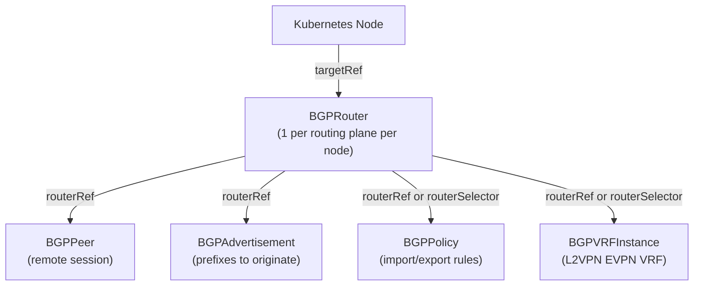

# Architecture

> Cosmos is a Go module that defines Kubernetes CRDs and API types for BGP routing and virtual networking. It is consumed as a library by external controller implementations; this repository contains no runtime code.

_Last updated: 2026-06-23_

---

## Table of Contents

1. [Overview](#overview)
2. [Repository Layout](#repository-layout)
3. [Module / Package Reference](#module--package-reference)
   - [api/bgp/v1alpha1](#apibgpv1alpha1)
   - [api/vpc/v1alpha1](#apivpcv1alpha1)
4. [API Resource Model](#api-resource-model)
   - [BGP Group](#bgp-group-bgpmiloapis)
   - [VPC Group](#vpc-group-vpcmiloapis)
5. [Entry Points](#entry-points)
6. [Data Flow](#data-flow)
7. [External Dependencies](#external-dependencies)
8. [Testing](#testing)
9. [CI/CD](#cicd)
10. [Known Constraints & Tech Debt](#known-constraints--tech-debt)
11. [For Claude](#for-claude)

---

## Overview

Cosmos defines the Kubernetes Custom Resource Definitions (CRDs) and Go API types for two networking domains:

- **BGP routing** (`bgp.miloapis.com`) — abstractions for BGP routers, peers, advertisements, policies, and L2VPN/EVPN VRF instances
- **Virtual networking** (`vpc.miloapis.com`) — abstractions for virtual private clouds and interface attachments

The module is a **library**, not a binary. External controllers import `go.miloapis.com/cosmos` to register these types with their scheme and reconcile the resources. Cosmos itself ships only the type definitions, validation rules, CRD YAML, and their tests. There are no controllers, no HTTP servers, no goroutines, and no persistent state within this module.

The design follows standard Kubernetes API conventions: resources have a `Spec` (desired state), a `Status` (observed state), and standard `metav1.Condition` conditions. CEL validation rules embedded in kubebuilder markers enforce invariants at the API server level (requiring Kubernetes 1.28+).

---

## Repository Layout

```
cosmos/
├── api/
│   ├── bgp/v1alpha1/          # bgp.miloapis.com/v1alpha1 — 5 CRD types + generated deepcopy
│   └── vpc/v1alpha1/          # vpc.miloapis.com/v1alpha1 — 2 CRD types + generated deepcopy
├── config/
│   ├── crd/                   # Generated CRD YAML (controller-gen output — never edit directly)
│   └── samples/               # Example resource manifests
├── docs/
│   ├── api/                   # Human-readable field reference (bgp.md, vpc.md)
│   ├── design/                # Design notes
│   ├── diagrams/              # PlantUML source and rendered diagrams
│   └── enhancements/          # Design proposals (KEP-style)
├── hack/
│   └── boilerplate.go.txt     # Copyright header injected into generated files
├── scripts/
│   └── e2e.sh                 # E2E orchestration script (setup → test → teardown)
├── test/e2e/
│   ├── chainsaw-config.yaml   # Chainsaw timeouts and cluster name
│   ├── kind-config.yaml       # kind cluster: 1 control-plane + 3 workers, dual-stack
│   ├── Taskfile.yaml          # E2E task targets (cluster, Cilium, CRDs, Chainsaw)
│   ├── fixtures/              # Shared test fixtures (BGPRouter manifests per node)
│   └── tests/                 # One directory per Chainsaw test scenario
├── bin/                       # Local dev tool binaries (gitignored)
├── go.mod                     # Module: go.miloapis.com/cosmos, Go 1.26
├── go.sum
├── Taskfile.yaml              # Primary task runner (build, lint, test, generate, manifests)
├── AGENTS.md                  # CLAUDE.md symlink target — project guidance for Claude Code
└── CLAUDE.md -> AGENTS.md     # Symlink: CLAUDE.md → AGENTS.md
```

---

## Module / Package Reference

### api/bgp/v1alpha1

**Purpose:** Defines all Go types, validation rules, and scheme registration for the `bgp.miloapis.com/v1alpha1` API group. Contains five CRD resources and their shared supporting types.

**Key files:**

| File                        | Contents                                                                                                                                                           |
|-----------------------------|-------------------------------------------------------------------------------------------------------------------------------------------------------------------|
| `groupversion_info.go`      | `GroupVersion`, `SchemeBuilder`, `AddToScheme` — scheme registration entry point                                                                                  |
| `router_types.go`           | `BGPRouter`, `BGPRouterSpec`, `BGPRouterStatus`                                                                                                                   |
| `peer_types.go`             | `BGPPeer`, `BGPPeerSpec`, `BGPPeerStatus`, condition constants, `updatePeerConditions`, `SetAcceptedCondition`                                                     |
| `advertisement_types.go`    | `BGPAdvertisement`, `BGPAdvertisementSpec`, `BGPAdvertisementStatus`                                                                                              |
| `policy_types.go`           | `BGPPolicy`, `BGPPolicySpec`, `BGPPolicyTerm`, `BGPPolicyMatch`, `PolicySetActions`, `CommunitySet`                                                               |
| `vrf_types.go`              | `BGPVRFInstance`, `BGPVRFInstanceSpec`, `BGPVRFInstanceStatus`, `RouteTarget`                                                                                     |
| `shared_types.go`           | `RouterTarget`, `RouterRef`, `RouterSelector`, `TargetRef`, `AddressFamily`, `AFI`, `SAFI`, `RouterRole`, `LocalSecretRef`, `RouterStatus`, `ResolvedRouterConfig` |
| `zz_generated.deepcopy.go`  | Generated `DeepCopy*` methods — do not edit                                                                                                                       |

**External dependencies:**
- `k8s.io/apimachinery/pkg/apis/meta/v1` — `metav1.TypeMeta`, `metav1.ObjectMeta`, `metav1.Condition`, `metav1.Duration`, `metav1.Time`
- `k8s.io/apimachinery/pkg/api/meta` — `meta.SetStatusCondition` (used in peer condition helpers)
- `sigs.k8s.io/controller-runtime/pkg/scheme` — `scheme.Builder` for type registration

**Owns persistent state:** No.

---

### api/vpc/v1alpha1

**Purpose:** Defines all Go types and scheme registration for the `vpc.miloapis.com/v1alpha1` API group. Contains two CRD resources.

**Key files:**

| File                        | Contents                                                                                                                   |
|-----------------------------|----------------------------------------------------------------------------------------------------------------------------|
| `groupversion_info.go`      | `GroupVersion`, `SchemeBuilder`, `AddToScheme`                                                                             |
| `vpc_types.go`              | `VPC`, `VPCSpec`, `VPCStatus`                                                                                              |
| `vpcattachment_types.go`    | `VPCAttachment`, `VPCAttachmentSpec`, `VPCAttachmentStatus`, `VPCRef`, `VPCAttachmentInterface`, `VPCAttachmentAnnotation` |
| `zz_generated.deepcopy.go`  | Generated `DeepCopy*` methods — do not edit                                                                                |

**External dependencies:**
- `k8s.io/apimachinery/pkg/apis/meta/v1` — `metav1.TypeMeta`, `metav1.ObjectMeta`
- `sigs.k8s.io/controller-runtime/pkg/scheme` — `scheme.Builder`

**Owns persistent state:** No.

---

## API Resource Model

### BGP Group (`bgp.miloapis.com`)

`BGPRouter` is the ownership root. Every other BGP resource binds to one or more routers.



**BGPRouter** — `bgprouters.bgp.miloapis.com`, shortName `bgpr`

One per routing plane per node. Declares the local ASN, router ID, address families, and node binding. Acts as the namespace-scoped ownership boundary for all other BGP resources.

Key spec fields:
- `targetRef.kind/name` — identifies the Kubernetes Node this router runs on
- `roles` — one or more of `fabric`, `tenant`, `transit` (at least one required)
- `localASN int64` — 2-byte or 4-byte BGP ASN (1–4294967295)
- `routerID string` — IPv4 dotted-decimal notation (logical identifier in IPv6-only underlays)
- `addressFamilies []AddressFamily` — AFI/SAFI pairs this router activates

Status: `phase` (Pending/Ready/Failed), `observedGeneration`, `peers` (total/established counts), `conditions`.

---

**BGPPeer** — `bgppeers.bgp.miloapis.com`, shortName `bgppr`

A BGP session to a remote peer. Binds to one or more BGPRouters via `routerRef` (single) or `routerSelector` (multi). Exactly one binding must be set — enforced by CEL.

Key spec fields:
- `RouterTarget` (inline) — `routerRef` or `routerSelector`
- `peerASN int64` — remote AS number
- `address string` — remote IPv4 or IPv6 address (CEL: `isIP(self)`)
- `addressFamilies []AddressFamily` — AFI/SAFI pairs negotiated on this session
- `holdTime *metav1.Duration` — 0 (disabled) or ≥3s; defaults to 90s
- `keepaliveTime *metav1.Duration` — must be ≤ holdTime/3; defaults to 30s
- `authSecretRef *LocalSecretRef` — optional MD5 TCP auth (key: `"password"`)

Status: `sessionState` (BGP FSM state), `lastEstablishedTime`, `observedGeneration`, `conditions`.

Condition constants defined in `peer_types.go`: `ConditionTypeReady`, `ConditionTypeAccepted`. Idle reason constants: `IdleReasonBackOff`, `IdleReasonConnectionRefused`, `IdleReasonHoldTimerExpired`, `IdleReasonIdle`.

Status helper methods (reference implementation for controller authors):
- `updatePeerConditions(state, gen, idleReason)` — sets Ready condition from FSM state
- `SetAcceptedCondition(accepted, gen, reason, message)` — sets Accepted condition

---

**BGPAdvertisement** — `bgpadvertisements.bgp.miloapis.com`, shortName `bgpadv`

Prefixes to originate from a single BGPRouter. Intentionally supports only `routerRef` (not `routerSelector`) to avoid ambiguous prefix attribution across multiple routers.

Key spec fields:
- `routerRef RouterRef` — direct binding to one BGPRouter (required)
- `addressFamily AddressFamily` — AFI/SAFI for this advertisement
- `prefixes []string` — 1–256 CIDR prefixes; each validated via CEL `isCIDR()`; `+listType=set`
- `communities []string` — 0–64 BGP communities in `ASN:NN` or `IP:NN` format
- `localPreference *uint32` — BGP LOCAL_PREF (iBGP only)

---

**BGPPolicy** — `bgppolicies.bgp.miloapis.com`, shortName `bgpp`

Composable, ordered routing policy applied to a BGPRouter in one direction (import or export). Binds via `routerRef` or `routerSelector`.

Key spec fields:
- `RouterTarget` (inline)
- `direction BGPPolicyDirection` — `import` or `export`
- `terms []BGPPolicyTerm` — 1–32 terms, each with a unique `sequence int32`, a `match`, and an `action` (`permit`/`deny`)

Term match fields: `any bool`, `addressFamilies []AddressFamily`.
Term set actions (permit only): `communities` (add/remove lists), `localPreference`.

CEL invariants: sequence numbers must be unique; `set` must not be present on `deny` terms.

---

**BGPVRFInstance** — `bgpvrfinstances.bgp.miloapis.com`, shortName `bgpvrf`

Configures an L2VPN EVPN VRF on matched BGPRouters. The targeted BGPRouter must have `l2vpn/evpn` in its `addressFamilies`.

Key spec fields:
- `RouterTarget` (inline)
- `routeDistinguisher string` — uniquely identifies the VRF; `ASN:NN` or `IP:NN` format
- `importRouteTargets []RouteTarget` — 1–32 RT extended communities for route import
- `exportRouteTargets []RouteTarget` — 1–32 RT extended communities for route export

Status: top-level `conditions`, plus per-router `routers []RouterStatus` (`+listType=map +listMapKey=routerName`). `RouterStatus` holds per-router conditions and a `ResolvedRouterConfig` snapshot.

---

### VPC Group (`vpc.miloapis.com`)

**VPC** — `vpcs.vpc.miloapis.com`

A virtual private cloud defined by CIDR blocks.

Key spec fields:
- `networks []string` — 1–64 IPv4 or IPv6 CIDRs; validated via CEL `isCIDR()`

Status: `ready bool`, `identifier string`.

---

**VPCAttachment** — `vpcattachments.vpc.miloapis.com`

Attaches a network interface to a VPC.

Key spec fields:
- `vpc VPCRef` — reference to a VPC by name in the same namespace
- `interface VPCAttachmentInterface` — interface name and 1–16 IPv4/IPv6 addresses (each validated via CEL `isCIDR()`)

Status: `ready bool`, `identifier string`.

Annotation: `k8s.v1alpha1.vpc.miloapis.com/vpc-attachment` (constant `VPCAttachmentAnnotation`).

---

## Entry Points

This module has no binaries. It is imported by external controllers as a Go library.

To register BGP types with a controller-runtime scheme:
```go
import bgpv1alpha1 "go.miloapis.com/cosmos/api/bgp/v1alpha1"

scheme.AddToScheme(bgpv1alpha1.AddToScheme)
```

To register VPC types:
```go
import vpcv1alpha1 "go.miloapis.com/cosmos/api/vpc/v1alpha1"

scheme.AddToScheme(vpcv1alpha1.AddToScheme)
```

Both `AddToScheme` values are produced by `sigs.k8s.io/controller-runtime/pkg/scheme.Builder` and registered via `init()` in each `*_types.go` file.

---

## Data Flow

There is no runtime data flow within this module. The flow belongs to external controllers that import these types:

```
User applies YAML manifest
        │
        ▼
Kubernetes API Server
  validates against CRD schema (CEL rules embedded in config/crd/*.yaml)
        │
        ▼
etcd (resource stored)
        │
        ▼
External controller (watches the API group via controller-runtime)
  imports go.miloapis.com/cosmos API types to decode resources
        │
        ▼
Controller reconciles: configures underlying BGP daemon (FRR, GoBGP, etc.)
        │
        ▼
Controller writes back .status (sessionState, conditions, observedGeneration)
```

The CRD YAML in `config/crd/` is the artifact deployed to a cluster. CEL rules in those manifests enforce field-level invariants at admission time (before a resource is stored), independent of any controller.

---

## External Dependencies

| Dependency                        | Version  | Purpose                                                                   |
|-----------------------------------|----------|---------------------------------------------------------------------------|
| `k8s.io/api`                      | v0.33.0  | Core Kubernetes API types                                                 |
| `k8s.io/apimachinery`             | v0.33.0  | `metav1` types, `meta.SetStatusCondition`, scheme/GVK machinery           |
| `sigs.k8s.io/controller-runtime`  | v0.21.0  | `scheme.Builder` for type registration (only the scheme package is used)  |

All other entries in `go.sum` are transitive dependencies of the above three.

**Dev tooling (local to `./bin/`, not in `go.mod`):**

| Tool              | Version  | Purpose                                                                                |
|-------------------|----------|----------------------------------------------------------------------------------------|
| `controller-gen`  | v0.18.0  | Generates `zz_generated.deepcopy.go` and `config/crd/*.yaml` from kubebuilder markers |
| `golangci-lint`   | v2.1.6   | Go linting                                                                             |
| `yamlfmt`         | v0.21.0  | YAML formatting; enforces consistent style                                             |
| `chainsaw`        | v0.2.12  | Kubernetes-native e2e test runner                                                      |

---

## Testing

### Unit tests

- Location: `api/bgp/v1alpha1/*_types_test.go`
- Framework: stdlib `testing` (no external test framework)
- Coverage: DeepCopy correctness, JSON round-trip fidelity, JSON field name verification, boundary values (max 4-byte ASN), status condition logic (`updatePeerConditions`, `SetAcceptedCondition`)
- Run: `GOOS=linux go test ./api/bgp/v1alpha1/... -v`  or `task test:unit`

There are no unit tests for the VPC package (VPC types have no methods beyond generated DeepCopy).

### E2E tests

- Location: `test/e2e/tests/` (one directory per scenario)
- Framework: [Chainsaw](https://kyverno.github.io/chainsaw/) v0.2.12
- Cluster: kind cluster `bgp-e2e` with 1 control-plane + 3 worker nodes, dual-stack (`ipFamily: dual`), Cilium CNI
- Kubernetes version: `kindest/node:v1.34.0`

E2E test scenarios:

| Scenario                   | What it tests                                               |
|----------------------------|-------------------------------------------------------------|
| `system-readiness`         | Cluster and CRD readiness after deploy                      |
| `bgp-peering`              | BGPPeer CRUD, full-mesh IPv6 peer creation across 3 workers |
| `bgp-peer-timers`          | HoldTime/KeepaliveTime field acceptance                     |
| `bgp-advertisement`        | BGPAdvertisement resource acceptance and schema validation   |
| `bgp-policy`               | BGPPolicy resource acceptance                               |
| `bgp-status-conditions`    | Status condition writes                                     |
| `bgp-vrf-crd-schema`       | BGPVRFInstance schema validation (RD, RT format)            |
| `vpc-crd-schema`           | VPC and VPCAttachment schema validation                     |

Chainsaw timeouts: apply=2m, assert=5m, delete=2m, exec=3m.

E2E setup steps (via `scripts/e2e.sh` → `test/e2e/Taskfile.yaml`):
1. Create kind cluster with dual-stack networking
2. Install Cilium v1.17.3 (CNI, non-exclusive mode)
3. Apply all CRDs via `kubectl apply -k config/crd/`
4. Apply BGPRouter fixtures for each worker node
5. Run Chainsaw tests (sequential: `--parallel 1`)
6. Teardown cluster on exit (trap)

Run: `task test:e2e` (requires Docker, kind, kubectl, chainsaw, helm in PATH).

---

## CI/CD

### Pipeline (`.github/workflows/ci.yaml`)

```
push/PR → main
      │
      ├── Build (go fmt + go vet + go build)
      │         │
      │    ┌────┴────┐
      │    │         │
      │  Test       Lint
      │  (unit)     (golangci-lint + yamlfmt + .yml check)
      │    │         │
      │    └────┬────┘
      │         │
      │        E2E
      │   (kind cluster, 30m timeout)
```

All jobs use Go 1.26 and cache the Go module download.

### Docker workflow (`.github/workflows/docker.yaml`)

Triggers: after CI succeeds on `main`, or on `v*` tag pushes.
Registry: `ghcr.io` (GitHub Container Registry).
Platforms: `linux/amd64`, `linux/arm64`.
Source: `build/Dockerfile` — **this file does not currently exist in the repository**. The workflow is present but will fail until a Dockerfile is added to `build/`.

### Dependency updates (Renovate)

Renovate runs weekly (Monday before 6am ET). k8s core libraries update monthly. Patch/minor non-k8s Go deps are auto-merged. Major updates require manual review.

---

## Known Constraints & Tech Debt

**No Dockerfile.** The Docker CI workflow (`docker.yaml`) references `build/Dockerfile`, which does not exist. Any attempt to trigger that workflow will fail at the build step.

**BGPAdvertisement has no routerSelector.** This is intentional (documented in code: "Fan-out via routerSelector is intentionally not supported to avoid ambiguous prefix attribution"), but it is an asymmetry from the other BGP resources that operators occasionally find surprising.

**VPC types are less mature.** The VPC package has no unit tests, uses `bool` for status (not `metav1.Condition`), and has commented-out default annotations (`+default:value=false`) that may not work as intended with controller-gen.

**Kubernetes 1.28+ hard requirement.** CEL functions `isIP()` and `isCIDR()` require Kubernetes 1.28+. The CRDs will fail to install on older clusters with a schema validation error. This is not documented in user-facing docs.

**All tools are version-pinned binaries in `./bin/`.** `task tools` must be run before any code generation or linting in a fresh checkout. `go install` is used to install them; there is no lockfile beyond the version suffix in the binary name.

**`CLAUDE.md` is a symlink to `AGENTS.md`.** Both files contain identical content. This is intentional to serve both Claude Code and other AI agents, but can confuse editors and git operations that follow symlinks.

---

## For Claude

**Start here for each concern:**

| Concern                                      | Where to look                                                                                         |
|----------------------------------------------|-------------------------------------------------------------------------------------------------------|
| Adding a new CRD                             | `api/bgp/v1alpha1/` — copy an existing `*_types.go`, register in `groupversion_info.go` via `init()` |
| Understanding a resource's validation rules  | Read the kubebuilder markers in the resource's `*_types.go` file; the CRD YAML is generated from them |
| Modifying shared types used across resources | `api/bgp/v1alpha1/shared_types.go`                                                                    |
| Status condition constants                   | Defined in the same file as the resource (e.g., `ConditionTypeReady` is in `peer_types.go`)           |
| Running tests locally                        | `task test:unit` (unit) or `task test:e2e` (e2e, requires Docker)                                     |
| Regenerating CRDs after marker changes       | `task generate && task manifests`                                                                      |

**Patterns that differ from Go idioms:**
- `init()` functions are used extensively to register types with the scheme builder. This is a Kubernetes operator convention, not general Go style.
- `int64` for ASN fields instead of `uint32` — necessary for valid OpenAPI v3 schema generation.
- No error returns from type methods — status updates use the Kubernetes condition pattern instead.

**Gotchas:**
- After any change to `// +kubebuilder:...` markers, both `task generate` and `task manifests` must be run. Forgetting one leaves the code and CRD YAML out of sync.
- `GOOS=linux` is required when running `go vet` or `go test` locally (the task targets set this). Some types have Linux-specific constraints.
- `CLAUDE.md` is a symlink. Edit `AGENTS.md` directly; attempts to edit through the symlink will fail.
- The VRF `BGPVRFInstanceStatus.Routers` field uses `+listType=map +listMapKey=routerName` — different from the standard `+listMapKey=type` used for conditions.
- `BGPPeerStatus` carries operational metrics: `lastStateChange`, `uptime`, `afiSafiStats` (per-AFI/SAFI prefix counts), and `messagesSent`/`messagesReceived` counters. The controller computes `uptime` from `lastStateChange`.
- `BGPVRFInstanceStatus` includes `evpnRouteCounts` (per-route-type counts) and has its own condition type constants (`ConditionTypeReady`, `ConditionTypeAccepted`) defined in `vrf_types.go`.
