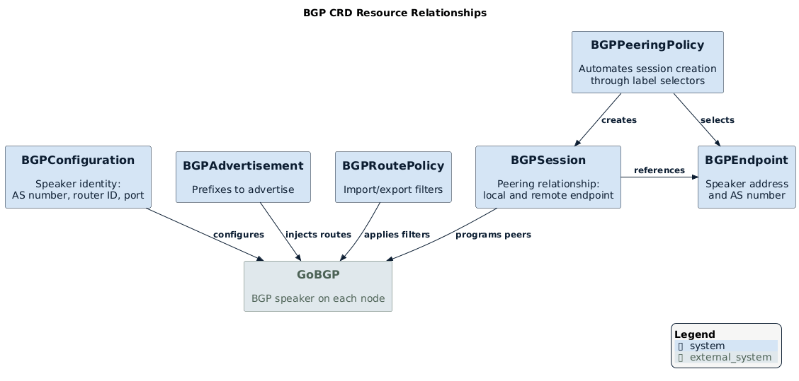
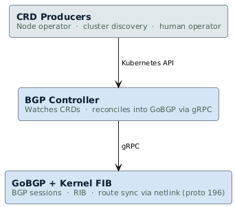

> **Archived.** This document describes the original design proposal for the BGP control plane.
> The resource model it describes (BGPConfiguration, BGPEndpoint, BGPPeeringPolicy) was
> superseded before implementation. The current API is documented in [docs/api/bgp.md](../api/bgp.md).
> This document is retained as historical context only.

# Service design: BGP control plane (historical)

## Table of contents

- [Summary](#summary)
- [Motivation](#motivation)
- [Proposal](#proposal)
  - [Developer experience](#developer-experience)
  - [Resource model](#resource-model)
  - [Architecture](#architecture)
- [Design details](#design-details)
  - [Controller composition](#controller-composition)
  - [GoBGP sidecar pattern](#gobgp-sidecar-pattern)
  - [How sessions form](#how-sessions-form)
  - [How routes are advertised](#how-routes-are-advertised)
  - [Route synchronization](#route-synchronization)
  - [Session state watching](#session-state-watching)
  - [Resilience and re-reconciliation](#resilience-and-re-reconciliation)
  - [Startup sequence](#startup-sequence)
  - [Metrics and observability](#metrics-and-observability)
- [User stories](#user-stories)
- [Drawbacks](#drawbacks)
- [Alternatives considered](#alternatives-considered)
- [Comparison with existing solutions](#comparison-with-existing-solutions)

---

## Summary

The [BGP][bgp] control plane (`milo-os/cosmos`) manages BGP topology
declaratively through Kubernetes [Custom Resource Definitions][crds] (CRDs) on
any Kubernetes-compatible API server, powered by [GoBGP][gobgp].

The project uses Kubernetes as a **control plane framework** — not as a
container orchestrator. You can run the controller anywhere you have a
Kubernetes-compatible API server: full clusters, [k3s][k3s], [KCP][kcp], or a
standalone kube-apiserver. No kubelet, scheduler, [CNI][cni], or pod networking
is required.

**API group:** `bgp.miloapis.com/v1alpha1`

Three design principles shape the project:

- **Topology-agnostic.** The controller doesn't know about nodes, clusters, or
  datacenter topology. All topology lives in the CRDs.
- **CNI-independent.** No dependency on any particular networking stack.
- **Producer/consumer model.** Any system that writes to the Kubernetes API can
  produce BGP topology. The controller reconciles it uniformly.

> [!NOTE]
>
> This project is in `v1alpha1`. APIs may change. See the
> [API reference](../api/README.md) for current field documentation.

---

## Motivation

[BGP][bgp] is fundamental to modern networking. It connects routers, establishes
reachability across [AS][asn] boundaries, and distributes the route information
that makes IP routing work. In cloud-native environments, BGP distributes pod
CIDRs, advertises service VIPs, and carries [SRv6][srv6] segment lists between
nodes.

Existing Kubernetes BGP implementations — Cilium, Calico, MetalLB, Kube-Router
— embed BGP management inside CNI-specific controllers. This coupling creates
two problems:

1. **BGP topology isn't reusable.** When you change your data plane, you also
   change your BGP management. No standard Kubernetes API exists for "this node
   has a BGP speaker" or "these two speakers should peer."

2. **BGP configuration is opaque.** You can't inspect session state with
   `kubectl`, write automation against the topology, or apply RBAC to BGP
   operations with standard Kubernetes tooling.

This project decouples BGP topology management from the data plane. The control
plane speaks BGP CRDs. The data plane reads routes from the kernel
[FIB][fib].

### Goals

- Manage BGP topology declaratively through Kubernetes CRDs.
- Keep the controller topology-agnostic — it reconciles whatever CRDs exist.
- Follow an independent producer/consumer model where any system can create
  CRDs and the controller reconciles them uniformly.
- Support [iBGP][ibgp], [eBGP][ebgp], [route reflection][rr], prefix
  advertisement, and route import/export policy.
- Synchronize learned BGP routes to the kernel [FIB][fib] through
  [netlink][netlink] (protocol ID 196).
- Surface session [FSM][bgp-fsm] state, prefix counts, and flap counters on
  BGPSession resources and as [Prometheus][prometheus] metrics.

### Non-goals

- **CNI implementation.** The project doesn't configure network interfaces,
  assign pod IPs, or implement pod networking.
- **[SRv6][srv6] encap/decap data plane.** The route syncer programs next-hops
  into the kernel FIB. The kernel and hardware handle forwarding.
- **Cluster discovery or fleet management.** Discovering peers across clusters
  is the responsibility of a higher-level system.
- **BGP security** (MD5 authentication, TCP-AO, RPKI) in the alpha release.
- **Multi-path/ECMP** configuration in the alpha release.

---

## Proposal

### Developer experience

Here's what it looks like to declare a BGP speaker, two endpoints, and a mesh
peering policy:

```bash
# Declare the local BGP speaker identity
kubectl apply -f - <<EOF
apiVersion: bgp.miloapis.com/v1alpha1
kind: BGPConfiguration
metadata:
  name: default
spec:
  asNumber: 65001
  listenPort: 1790
  routerIDSource: NodeIP
EOF

# Declare two endpoints (normally created by a node operator)
kubectl apply -f - <<EOF
apiVersion: bgp.miloapis.com/v1alpha1
kind: BGPEndpoint
metadata:
  name: node-a
  labels:
    topology.example.com/region: us-east
spec:
  address: "2001:db8::1"
  asNumber: 65001
---
apiVersion: bgp.miloapis.com/v1alpha1
kind: BGPEndpoint
metadata:
  name: node-b
  labels:
    topology.example.com/region: us-east
spec:
  address: "2001:db8::2"
  asNumber: 65001
EOF

# Automate peering — full mesh within the region
kubectl apply -f - <<EOF
apiVersion: bgp.miloapis.com/v1alpha1
kind: BGPPeeringPolicy
metadata:
  name: us-east-mesh
spec:
  selector:
    matchLabels:
      topology.example.com/region: us-east
  mode: mesh
EOF
```

Then inspect session state:

```bash
kubectl get bgpsessions
# NAME               LOCAL    REMOTE    SESSION       RX PREFIXES
# node-a--node-b     node-a   node-b    Established   4
```

### Resource model

The API defines six cluster-scoped resources. All resources are cluster-scoped
because BGP topology spans namespace and cluster boundaries. For complete field
documentation, see the [API reference](../api/README.md).

| Resource | Kind | Short name | Purpose |
|----------|------|------------|---------|
| `bgpconfigurations` | `BGPConfiguration` | `bgpconfig` | Local speaker identity (AS, port, router ID) |
| `bgpendpoints` | `BGPEndpoint` | `bgpep` | Self-advertisement: "I exist at this address" |
| `bgpsessions` | `BGPSession` | `bgpsess` | Peering relationship between two endpoints |
| `bgppeeringpolicies` | `BGPPeeringPolicy` | `bgppp` | Automates session creation through label selectors |
| `bgpadvertisements` | `BGPAdvertisement` | `bgpadvert` | Prefix advertisement |
| `bgproutepolicies` | `BGPRoutePolicy` | `bgprp` | Import/export filtering rules |

The following diagram shows how these resources relate to each other and to
the GoBGP speaker:

<p align="center">
  
</p>

### Architecture

The system has three layers:

<p align="center">
  
</p>

**Layer 1 — CRD producers.** Any system that creates BGP CRDs. A node
operator creates one `BGPEndpoint` per node. A cluster discovery system
creates `BGPPeeringPolicy` resources for multi-cluster peering. You can also
create resources manually for custom topologies or debugging.

**Layer 2 — BGP controller.** This project. Watches BGP CRDs and reconciles
them into GoBGP [gRPC][grpc] calls. The controller is topology-agnostic — it doesn't
know which session belongs to which node, or whether two endpoints are in the
same cluster. It reconciles every `BGPSession` where `spec.localEndpoint`
matches the `--local-endpoint` flag.

**Layer 3 — GoBGP + kernel FIB.** GoBGP runs as a sidecar container on each
node. It maintains BGP sessions and the [RIB][rib]. The route watcher streams
best-path events from GoBGP and programs kernel routes through
[netlink][netlink] with protocol ID 196.

**Per-node pod layout:**

Each node runs one pod with two runtime containers and one init container:

| Container | Role |
|-----------|------|
| `bgp` | Controller binary. Reconciles CRDs, polls session state, programs kernel routes. |
| `gobgpd` | GoBGP daemon. Maintains BGP sessions and the RIB. Listens on `127.0.0.1:50051`. |
| `config-gen` (init) | Discovers the node's global-scope IPv6 address and generates the initial `gobgp.conf`. |

Each controller instance reconciles only sessions where `spec.localEndpoint`
resolves to this node's endpoint. Multiple instances run in the same cluster,
and each handles only its own sessions.

---

## Design details

### Controller composition

The controller registers five reconcilers with a
[controller-runtime](https://github.com/kubernetes-sigs/controller-runtime)
manager. Each reconciler handles one CRD kind:

| Reconciler | CRD | GoBGP operation |
|-----------|-----|-----------------|
| `ConfigReconciler` | `BGPConfiguration` | `StartBgp` (AS, router ID, listen port) |
| `SessionReconciler` | `BGPSession` | `AddPeer` / `UpdatePeer` / `DeletePeer` |
| `PeeringPolicyReconciler` | `BGPPeeringPolicy` | Creates and deletes `BGPSession` CRDs (no direct GoBGP calls) |
| `AdvertisementReconciler` | `BGPAdvertisement` | `AddPath` / `DeletePath` |
| `RoutePolicyReconciler` | `BGPRoutePolicy` | `AddPolicy` / `DeletePolicy` |

The reconcilers are decoupled from each other. `PeeringPolicyReconciler`
creates `BGPSession` resources as Kubernetes objects — it doesn't call GoBGP
directly. `SessionReconciler` picks up those resources and calls GoBGP. This
means you can:

- Create `BGPSession` resources manually without a policy.
- Create a `BGPPeeringPolicy` without a `BGPAdvertisement`.
- Mix manually created and policy-generated sessions.

**ConfigReconciler** reconciles the singleton `BGPConfiguration` resource
(expected name: `default`). It calls GoBGP's `StartBgp` API with the AS
number, listen port, and address families. It resolves the router ID from
`routerIDSource`: `NodeIP` derives it from the node's IPv6 InternalIP, and
`Manual` uses `spec.routerID` directly.

**SessionReconciler** reconciles `BGPSession` resources where
`spec.localEndpoint` matches the controller's `--local-endpoint` flag. Each
node reconciles only its own sessions. On creation, it calls `AddPeer` and
falls back to `UpdatePeer` if the peer already exists. On deletion, it calls
`DeletePeer`.

**PeeringPolicyReconciler** materializes `BGPSession` objects from policy:

- In **mesh mode**, it creates one session for every pair (A, B) where
  `A.name < B.name`. This produces N\*(N-1)/2 sessions for N endpoints.
- In **route-reflector mode**, it resolves the reflector endpoint from
  `routeReflectorConfig.reflectorSelector` and creates one session between
  the reflector and each client endpoint.

The reconciler uses [server-side apply][ssa] to own the sessions it creates.
It deletes sessions for endpoints that no longer match the selector.

**AdvertisementReconciler** calls GoBGP's `AddPath` to inject each prefix into
the local RIB. On GoBGP restart, `FullReconcile` bumps an annotation to
trigger re-injection.

**RoutePolicyReconciler** translates each `PolicyStatement` into a GoBGP
policy definition and installs import or export filters.

### GoBGP sidecar pattern

GoBGP runs as a sidecar container in the same DaemonSet pod as the controller.
They communicate over gRPC on localhost. This pattern provides:

- **No network policy concerns** between the controller and the BGP daemon.
- **Independent restarts.** GoBGP can restart without restarting the
  controller.
- **Per-node scope.** Each node has its own BGP speaker with its own peers.

The controller treats GoBGP as **stateless**. All desired BGP state lives in
the CRDs. If GoBGP restarts, the controller's `FullReconcile` re-applies the
complete desired state.

The `config-gen` init container generates a minimal `gobgp.conf` for bootstrap
(AS number, router ID, listen port). The `BGPConfiguration` CRD overrides
these values at runtime through the gRPC API. The bootstrap config is only
needed for GoBGP's initial startup — no persistent configuration file is
required.

### How sessions form

1. A CRD producer creates `BGPEndpoint` resources, one per speaker, with
   topology labels.
2. A `BGPPeeringPolicy` selects those endpoints by label and specifies a mode
   (`mesh` or `route-reflector`).
3. `PeeringPolicyReconciler` materializes `BGPSession` resources — one per
   endpoint pair in mesh mode, or one per client-reflector pair in
   route-reflector mode.
4. `SessionReconciler` on each node reconciles sessions where the local
   endpoint matches, and calls `AddPeer` on GoBGP.
5. GoBGP establishes the TCP session and runs the BGP
   [finite state machine][bgp-fsm].
6. The peer state watcher updates session state, prefix counts, and flap
   counters.

### How routes are advertised

1. You create a `BGPAdvertisement` resource that declares one or more IPv6
   prefixes.
2. `AdvertisementReconciler` calls GoBGP's `AddPath` API to inject the
   prefixes into the local RIB.
3. GoBGP advertises them to established peers according to routing policy.
4. Optionally, a `BGPRoutePolicy` applies import/export filters per peer,
   using prefix matching with optional mask-length ranges.

### Route synchronization

The route watcher runs as a background goroutine. It opens a `WatchEvent`
stream on GoBGP that requests best-path updates (with the `BEST` filter and
`Init: true`).

For each best-path event, the watcher:

1. Extracts the [NLRI][nlri] and next-hop from the BGP path attributes.
2. Skips routes matching the node's own SRv6 prefix (from the `SRV6_NET`
   environment variable) to avoid self-routing.
3. For path additions, programs a kernel route through netlink with
   protocol ID 196.
4. For path withdrawals, removes the kernel route.

The `Init: true` flag causes GoBGP to replay all current best paths when the
stream opens. This rebuilds the full kernel FIB on every restart without
tracking state.

Protocol ID 196 distinguishes BGP-programmed routes from routes installed by
other systems. To list these routes:

```bash
ip -6 route show proto 196
```

### Session state watching

A background goroutine opens a `WatchEvent` stream on GoBGP filtered for peer
state change events. When a peer state change arrives, the watcher:

1. Finds the corresponding `BGPSession` resource by matching the event's
   neighbor address against remote endpoint addresses.
2. Updates `status.sessionState`, `status.receivedPrefixes`,
   `status.advertisedPrefixes`, `status.flapCount`, and
   `status.lastTransitionTime`.
3. Sets the `SessionEstablished` condition.
4. Emits Prometheus metrics.

Because the watcher reacts to events rather than sampling on a timer, status
reflects the actual session state immediately. Every state transition produces
an event, so flaps are no longer invisible.

If the stream breaks, the watcher reconnects after a brief delay using the
same retry pattern as the route watcher.

### Resilience and re-reconciliation

A health watcher goroutine polls GoBGP every 5 seconds through `GetBgp`. When
it detects a failure, it:

1. Closes the stale gRPC connection.
2. Reconnects with retries (up to 30 attempts at 2-second intervals).
3. On successful reconnection, calls `FullReconcile`.

`FullReconcile` re-applies all desired state:

- All `BGPSession` resources through `AddPeer`/`UpdatePeer` (resolving
  endpoints and rebuilding the GoBGP peer struct for each).
- All `BGPAdvertisement` resources by bumping a reconcile-trigger annotation,
  which causes the reconciler to re-inject prefixes.
- All `BGPRoutePolicy` resources the same way.

The `BGPConfiguration` is handled separately by the `ConfigReconciler` through
its normal watch-based reconciliation.

The `BGPConfiguration` is handled separately by the `ConfigReconciler` through
its normal watch-based reconciliation.

After `FullReconcile`, GoBGP state is fully consistent with the CRDs.

The peer state watcher and route watcher each manage their own `WatchEvent`
stream connections independently. If either stream breaks, it reconnects with
the same retry logic — separate from the health watcher cycle.

### Startup sequence

1. `GoBGPClient.Connect()` — dials `127.0.0.1:50051` with retries
   (30 attempts, 2 seconds apart).
2. Builds the `controller-runtime` manager with Kubernetes and BGP type
   schemes.
3. Registers the five reconcilers.
4. Adds health (`/healthz`) and readiness (`/readyz`) probes.
5. Starts background goroutines: health watcher, peer state watcher, route
   watcher.
6. `manager.Start()` — begins watching CRDs and reconciling.

The controller doesn't start reconciling until GoBGP is reachable. If GoBGP
doesn't respond within 60 seconds, the controller exits and the pod restarts.

### Metrics and observability

The controller exposes Prometheus metrics on the `--metrics-addr` port:

| Metric | Type | Labels | Description |
|--------|------|--------|-------------|
| `bgp_session_state` | Gauge | `session`, `state` | 1 for the active FSM state, 0 for all others |
| `bgp_received_prefixes_total` | Gauge | `session` | Prefixes received from the remote peer |
| `bgp_session_flaps_total` | Counter | `session` | Number of times the session left Established state |
| `bgp_advertised_prefixes_total` | Gauge | `advertisement` | Prefixes currently in the GoBGP RIB |
| `bgp_route_policies_applied` | Gauge | `policy` | 1 if the policy is applied to GoBGP, 0 otherwise |

Session metrics (`bgp_session_state`, `bgp_received_prefixes_total`,
`bgp_session_flaps_total`) are emitted when the peer state watcher receives a
state change event, not on a fixed timer.

Health and readiness probes are served on the `--health-addr` port:

- `/healthz` — liveness (controller process is alive)
- `/readyz` — readiness (controller-runtime manager is ready)

---

## User stories

**As a platform operator,** I want to declare BGP peering topology through
`kubectl apply` so that BGP configuration is version-controlled, auditable,
and managed with the same tooling as the rest of my infrastructure.

**As a network engineer,** I want to inspect BGP session state with
`kubectl get bgpsessions` so that I can diagnose connectivity problems without
logging into individual nodes.

**As an automation system** (node discovery operator, cluster fleet manager),
I want to create `BGPEndpoint` resources for each node and let the
`BGPPeeringPolicy` controller create sessions automatically, so that topology
scales without per-node manual configuration.

**As a multi-cluster operator,** I want to declare eBGP sessions between
clusters by creating `BGPSession` resources with endpoints that have different
`asNumber` values, without modifying the BGP controller.

**As a platform engineer debugging a network outage,** I want to see flap
counts and last-transition timestamps on `BGPSession` resources so I can
correlate BGP instability with other events.

---

## Drawbacks

**GoBGP sidecar coupling.** The controller is tightly coupled to GoBGP's gRPC
API. Replacing GoBGP with another daemon (BIRD, FRRouting) would require
rewriting the client layer.

**Peer state watcher reconnection gap.** If the `WatchEvent` stream breaks and
the watcher is reconnecting, state changes during that window aren't captured
until the stream reopens. The gap is short (bounded by the retry interval),
but a rapid flap during reconnection won't appear in the status history.

**Session ownership model.** Each controller instance reconciles only sessions
where `spec.localEndpoint` matches its `--local-endpoint` flag. If a
`BGPSession` names a non-existent endpoint as local, it won't be reconciled
without operator intervention.

---

## Alternatives considered

**Embed BGP in the CNI.** This is the Cilium/Calico/MetalLB approach. Rejected
because it couples BGP management to the data plane and prevents reuse across
networking stacks.

**Use [FRRouting][frr] instead of GoBGP.** FRR has broader protocol support and
wider production deployment. GoBGP was chosen for the alpha release because its
gRPC API is designed for programmatic control. FRR is a viable alternative
backend for future evaluation.

**Push configuration files instead of gRPC.** Writing config files and sending
SIGHUP is an alternative to gRPC. Rejected because gRPC provides richer status
feedback and is GoBGP's intended programmatic interface.

**Namespace-scoped resources.** Rejected because BGP topology spans namespaces
and clusters. Cluster-scoped resources reflect the actual topology boundary.

---

## Comparison with existing solutions

| Feature | This project | Cilium BGP | Calico BGP | MetalLB |
|---------|-------------|------------|------------|---------|
| CNI dependency | None | Cilium | Calico | None |
| Topology awareness | None (by design) | Node-centric | Node-centric | LoadBalancer-centric |
| Session model | CRD (`BGPPeer`) | ConfigMap | `BGPPeer` CRD | `BGPPeer` CRD |
| Advertisement model | `BGPAdvertisement` CRD | Auto from services | Auto from pods/services | Auto from services |
| Route filtering | `BGPRoutePolicy` CRD | Policy CRD | `BGPFilter` CRD | Limited |
| Route-reflector support | `BGPPeeringPolicy` CRD | Yes | Yes | No |
| Multi-cluster support | Through label selectors | Limited | Limited | No |
| BGP daemon | [GoBGP][gobgp] (sidecar) | GoBGP (embedded) | [BIRD][bird] | [FRR][frr] |

<!-- References: protocols and standards -->
[bgp]: https://datatracker.ietf.org/doc/html/rfc4271
[ibgp]: https://datatracker.ietf.org/doc/html/rfc4271#section-5
[ebgp]: https://datatracker.ietf.org/doc/html/rfc4271#section-5
[rr]: https://datatracker.ietf.org/doc/html/rfc4456
[asn]: https://www.iana.org/assignments/as-numbers/as-numbers.xhtml
[srv6]: https://datatracker.ietf.org/doc/html/rfc8986
[bgp-fsm]: https://datatracker.ietf.org/doc/html/rfc4271#section-8
[nlri]: https://datatracker.ietf.org/doc/html/rfc4271#section-4.3
[fib]: https://en.wikipedia.org/wiki/Forwarding_information_base
[rib]: https://en.wikipedia.org/wiki/Routing_table
[grpc]: https://grpc.io/

<!-- References: tools and projects -->
[gobgp]: https://github.com/osrg/gobgp
[frr]: https://frrouting.org/
[bird]: https://bird.network.cz/
[netlink]: https://man7.org/linux/man-pages/man7/netlink.7.html
[prometheus]: https://prometheus.io/

<!-- References: Kubernetes concepts -->
[crds]: https://kubernetes.io/docs/concepts/extend-kubernetes/api-extension/custom-resources/
[cni]: https://www.cni.dev/
[kcp]: https://www.kcp.io/
[k3s]: https://k3s.io/
[ssa]: https://kubernetes.io/docs/reference/using-api/server-side-apply/
