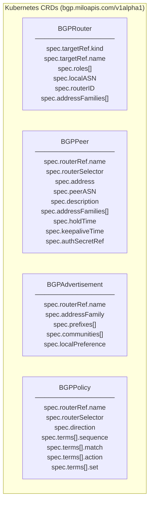

# BGP CRD Field Reference

This document describes the fields on each BGP CRD and how resources relate to
one another. Cosmos is an API project — it defines resources, relationships,
and validation contracts. It does not define how routing intent is realized.

## CRD Overview



## Ownership Hierarchy

```
BGPRouter            (primary ownership boundary — local AS, router ID, address families)
├── BGPPeer          (routerRef XOR routerSelector)
├── BGPPolicy   (routerRef XOR routerSelector; import or export direction)
└── BGPAdvertisement (routerRef only; single-router scope)

```

## Address Family Matrix

`addressFamilies` entries on `BGPRouter` and `BGPPeer`, and the `addressFamily`
field on `BGPAdvertisement`, use an AFI/SAFI struct. Valid combinations:

| AFI     | SAFI      | Use                             |
|---------|-----------|---------------------------------|
| `ipv4`  | `unicast` | IPv4 unicast routing            |
| `ipv6`  | `unicast` | IPv6 unicast routing (underlay) |
| `l2vpn` | `evpn`    | EVPN overlay routing            |

All other combinations are rejected by CRD CEL validation.

## Router Targeting

Resources bind to routers via one of two mutually exclusive mechanisms:

| Mechanism        | Field               | Scope       | Supported by                         |
|------------------|---------------------|-------------|--------------------------------------|
| Direct reference | `routerRef.name`    | Single router | BGPPeer, BGPPolicy, BGPAdvertisement |
| Label selector   | `routerSelector`    | Multiple routers | BGPPeer, BGPPolicy             |

`BGPAdvertisement` supports `routerRef` only. Selector fan-out is intentionally
not supported on advertisements to avoid ambiguous prefix attribution.

## BGPPolicy Term Structure

Each term in `spec.terms` is evaluated from lowest to highest `sequence` number.
The first matching term wins.

```
term:
  sequence: <1–65535>   # unique within the policy; evaluated ascending
  match:
    any: true            # matches all routes (mutually exclusive with other match fields)
    addressFamilies:     # constrains to specific AFI/SAFI combinations
      - afi: ipv6
        safi: unicast
  action: permit | deny
  set:                   # only valid when action is "permit"
    communities:
      add: ["65000:100"]
      remove: ["65000:200"]
    localPreference: 150
```

## Files

| Component | Path |
|-----------|------|
| BGP CRD types | `api/bgp/v1alpha1/*_types.go` |
| Shared types (AFI, SAFI, RouterTarget, etc.) | `api/bgp/v1alpha1/shared_types.go` |
| Generated deepcopy | `api/bgp/v1alpha1/zz_generated.deepcopy.go` |
| CRD manifests | `config/crd/bgp.miloapis.com_*.yaml` |
| Example manifests | `docs/examples/` |
