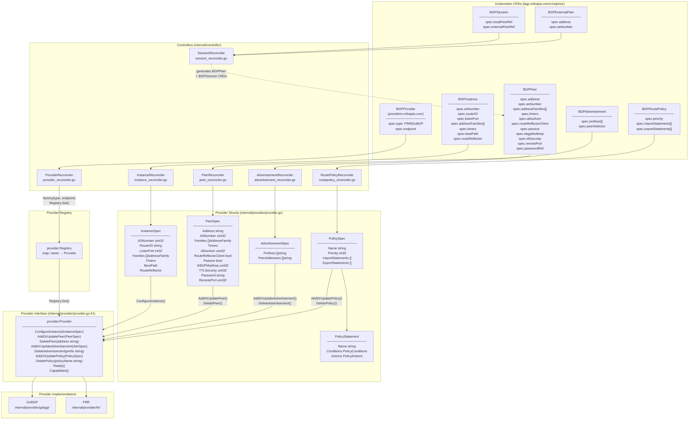

# CRD to BGPProvider Struct Mapping

This diagram shows how Kubernetes CRDs flow through reconcilers, get converted to provider structs, and are dispatched to the `Provider` interface.



## Key Reference Resolution

Before building provider structs, reconcilers resolve indirect references:

| Reconciler | Resolution Step |
|---|---|
| **InstanceReconciler** | RouterID: resolves from node annotation or Downward API env `NAMESPACE` |
| **PeerReconciler** | Timers: merges instance-level defaults with peer-level overrides |
| **PeerReconciler** | Password: fetches from `spec.passwordRef` Secret |
| **AdvertisementReconciler** | PeerAddresses: expands `spec.peerSelector` label query → `[]string` of peer IPs |
| **ProviderReconciler** | Endpoint: extracted from `BGPProvider.Spec`, passed to `ProviderFactory` |

## CRD Ownership Hierarchy

```
BGPProvider  ←── BGPInstance (providerSelector)
                      ↑
              BGPPeer (instanceRef + providerRef/Selector)
              BGPAdvertisement (instanceRef)
              BGPRoutePolicy (instanceRef)
                      ↑
              BGPSession → generates BGPPeer + links BGPExternalPeer
```

## Files

| Component | Path |
|---|---|
| BGP CRD types | `api/bgp/v1alpha1/*_types.go` |
| Provider CRD type | `api/providers/v1alpha1/provider_types.go` |
| Provider interface + structs | `internal/provider/provider.go` |
| Reconcilers | `internal/controller/*_reconciler.go` |
| GoBGP implementation | `internal/provider/gobgp/` |
| FRR implementation | `internal/provider/frr/` |
